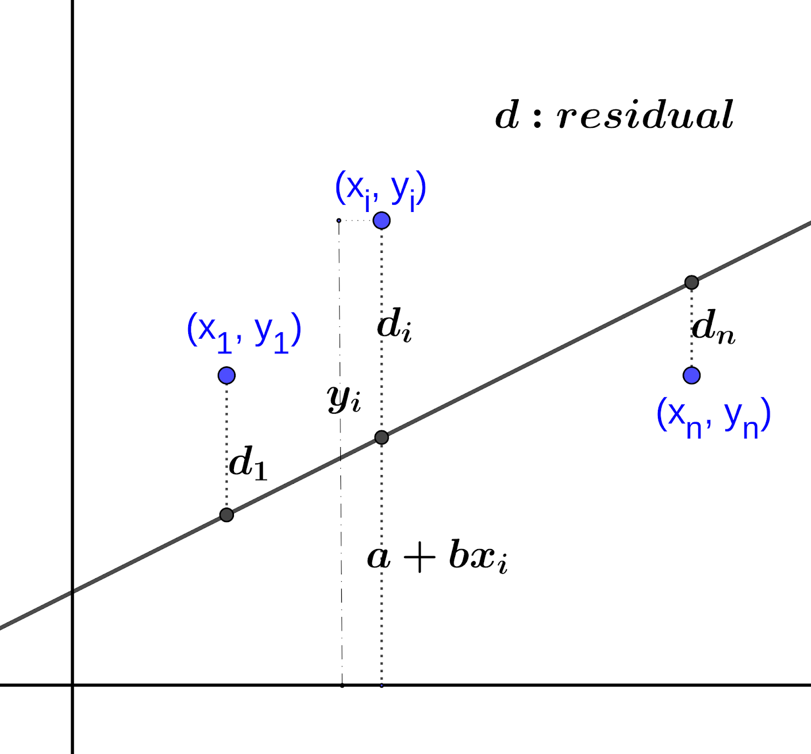
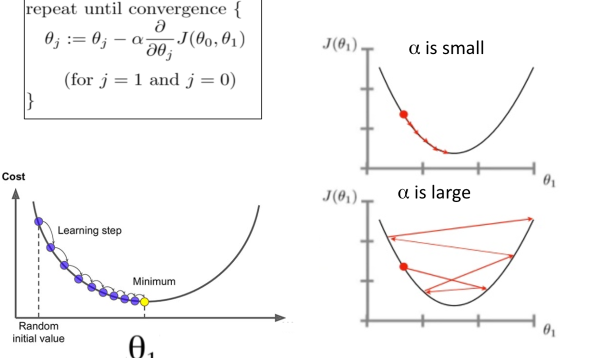

## ML2: Regression

### 핵심 한 줄
- 회귀는 `Y`와 `X`의 관계식을 추정해 예측하고, 해석 가능한 계수로 영향 방향과 크기를 읽는 방법이다.

### 핵심 도표

### 회귀의 기본
- 목적: 종속변수(Y)와 독립변수(X)의 함수 관계 추정
- 용어: target, predictor, regressor, parameter, error
- 유형:
- 모수적 회귀: 선형회귀, 로지스틱회귀
- 비모수적 회귀: 트리, 랜덤포레스트 등

### 선형회귀(OLS) 핵심
- 아이디어: 잔차 제곱합(SSE)을 최소화
- 직관: 오차의 부호(+/-)가 상쇄되지 않도록 제곱 사용
- 다변량 확장: 행렬식으로 일반화 가능
- 가정(요지): 선형성, 오차 평균 0, 등분산, 자기상관 없음 등

### 결과 해석
- 계수 부호: `+`면 증가 방향, `-`면 감소 방향
- 계수 크기 비교:
- 단위가 다르면 표준화 후 비교가 안전
- 유의성:
- p-value로 통계적 유의성 확인

### 평가지표
- `R^2`: 설명력
- `MSE`: 큰 오차에 민감(제곱)
- `MAE`: 절대 오차 평균(해석 직관적)
- `MAPE`: 퍼센트 오차(0 근처 데이터 주의)

### OLS 한계
- 비선형 관계를 직접 잘 못 잡음
- 가정 위반 시 성능/해석 저하
- 이상치 영향이 큼

### 경사하강법(Gradient Descent)
- 목표: 비용함수(loss)를 반복적으로 최소화
- 업데이트: `theta = theta - alpha * gradient`
- 학습률(alpha) 핵심:
- 너무 크면 발산, 너무 작으면 수렴이 느림
- 발전 형태:
- 배치/확률적/미니배치 방식으로 계산 효율 개선

### 복습 체크포인트
- "선형 가정이 타당한가?"
- "평가지표를 문제 특성에 맞게 골랐는가?"
- "학습률과 수렴 상태를 점검했는가?"
