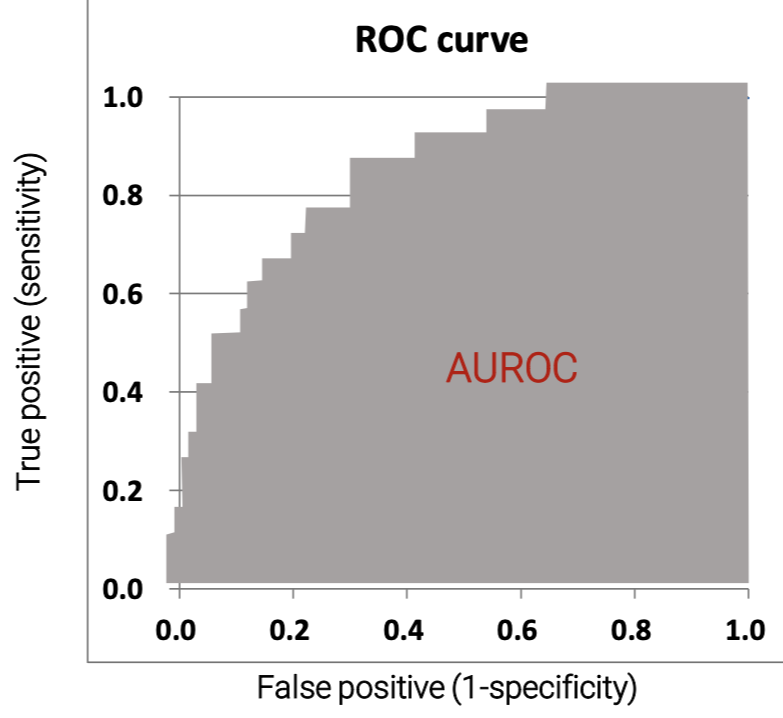

## ML3: Classification - Logistic Regression

### 핵심 한 줄
- 로지스틱 회귀는 이진 분류에서 확률을 예측하고, 오즈비(OR)로 변수 효과를 해석하는 기준 모델이다.

### 핵심 도표

### 왜 선형회귀 대신 로지스틱인가
- 분류 타겟은 범주형(0/1)이라 선형회귀의 연속값 가정이 부적합
- 로지스틱 함수로 예측값을 `0~1` 확률로 제한

### 로지스틱 회귀 핵심
- 출력: `Pr(y=1|x)`
- 판정: cut-off(예: 0.5)를 기준으로 클래스 결정
- 학습: 로그손실(log-loss) 최소화

### 해석 포인트
- 계수(beta)는 로그오즈(log-odds) 변화량
- 오즈비(OR) = `exp(beta)`
- OR > 1: 위험/발생 가능성 증가
- OR < 1: 위험/발생 가능성 감소
- 예시 해석:
- OR=1.53이면 변수 1단위 증가 시 오즈가 약 53% 증가

### 과적합과 정규화
- 과적합: 학습 데이터에 과도 적합
- 정규화:
- L1: 일부 계수를 0으로 만들어 변수선택 효과
- L2: 계수를 전반적으로 작게 만들어 안정화

### 분류 성능평가 핵심
- 혼동행렬: TP, TN, FP, FN
- 지표:
- Precision, Recall(민감도), F1, Accuracy
- ROC-AUC:
- cut-off를 바꿔도 모델 분리력 자체를 비교 가능
- 실무 관점:
- FP/FN 비용이 다르면 cut-off를 업무 목적에 맞춰 조정

### 복습 체크포인트
- "이 문제는 FN(놓침)과 FP(오탐) 중 무엇이 더 치명적인가?"
- "AUC만 보지 말고 Precision-Recall도 함께 봤는가?"
- "OR 해석 시 기준집단과 변수 단위를 확인했는가?"
