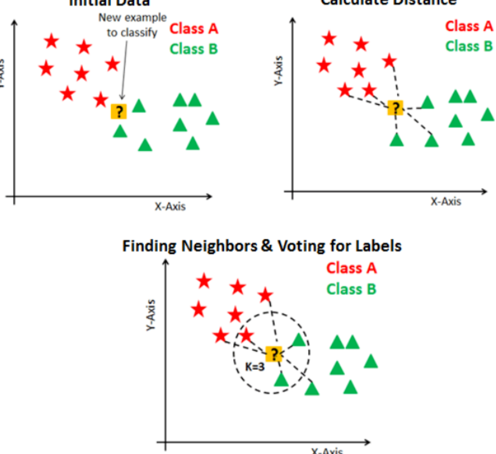
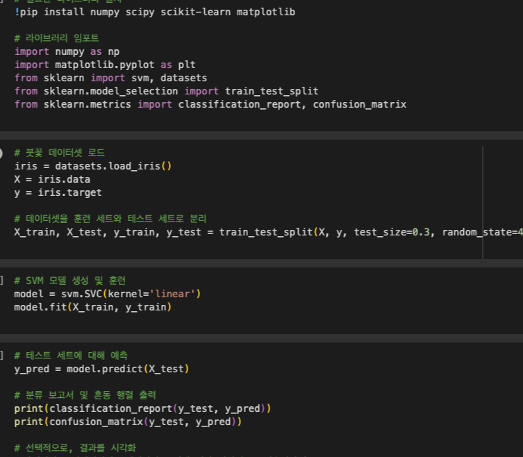

## ML4: Other Supervised Models

### 핵심 한 줄
- 분류 문제는 데이터 구조에 따라 Softmax, KNN, Naive Bayes, Tree/Ensemble, SVM 중 적합한 도구를 고르는 게 핵심이다.

### 핵심 도표

### Softmax Regression
- 로지스틱 회귀의 다중분류 확장
- 각 클래스 확률을 계산하고 가장 큰 확률 클래스로 분류

### K-Nearest Neighbors (KNN)
- 아이디어: "가까운 이웃 K개의 다수결"
- 거리척도: 유클리드, 맨해튼, 코사인, 해밍, 마할라노비스
- K 선택:
- 너무 작으면 노이즈 민감(과적합)
- 너무 크면 경계가 뭉개짐(과소적합)
- 특징:
- 학습은 거의 없고, 예측 시 계산량 큼

### Naive Bayes
- 베이즈 정리 기반 확률 분류
- 핵심 가정: 특징 간 조건부 독립
- 장점:
- 빠르고 고차원 텍스트에 강함
- 단점:
- 독립성 가정이 깨지면 성능 저하

### Decision Tree (CART)
- 불순도(지니/엔트로피) 감소가 큰 분기를 반복
- 장점:
- 해석이 쉽고 범주형/수치형 모두 처리
- 단점:
- 데이터 작은 변화에도 구조가 변해 과적합 위험
- 대응:
- 가지치기, 최대깊이/최소표본 등 종료조건 설정

### Ensemble
- Bagging/Random Forest:
- 여러 트리를 평균내 분산 감소, 안정적 성능
- Boosting(XGBoost/LightGBM):
- 약한 학습기를 순차 보완해 성능 극대화
- 주의:
- 과적합/하이퍼파라미터 민감도 관리 필요

### Support Vector Machine (SVM)
- 핵심: 마진 최대화로 일반화 성능 확보
- 커널: 선형 분리가 어려운 데이터를 고차원으로 매핑
- 주요 파라미터:
- `C`(오분류 허용 vs 마진), 커널 타입
- 장점:
- 고차원 분류에 강함
- 단점:
- 스케일링/파라미터 튜닝 중요, 대용량에서 느릴 수 있음

### 복습 체크포인트
- "해석 가능성이 중요한가, 최고 성능이 중요한가?"
- "데이터 크기와 피처 수에 맞는 모델 복잡도인가?"
- "거리기반(KNN/SVM)은 스케일링을 했는가?"
