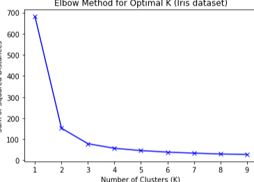
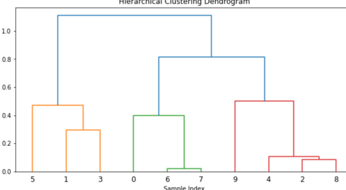

## ML5: Unsupervised Learning

### 핵심 한 줄
- 비지도학습은 정답 없이 데이터의 구조를 찾아내는 방법이며, 군집화가 대표적인 출발점이다.

### 핵심 도표

### 비지도학습 목적
- 타겟변수 없이 패턴/구조 발견
- 주요 활용:
- 군집화(세분화), 차원축소, 이상치탐지, 생성모형, 연관규칙

### 군집분석 핵심
- 목표: 같은 군집 내 유사도는 높고, 군집 간 유사도는 낮게
- 유사도/거리 척도:
- 유클리드, 맨해튼, 코사인, 해밍, 마할라노비스
- 데이터 종류(수치/텍스트/이진)에 맞는 거리 선택이 중요

### K-means
- 절차:
- `K`개 중심 초기화 -> 할당 -> 중심 재계산 반복
- 장점:
- 단순하고 빠름
- 한계:
- 초기 중심값/이상치에 민감, 구형 군집에 유리
- K 선택:
- 엘보우(Within-cluster SSE)로 후보 탐색

### 계층적 군집분석
- 바텀업(Agglomerative): 가까운 군집부터 병합
- 덴드로그램을 원하는 높이에서 잘라 군집 수 결정
- 장점:
- 군집 구조를 시각적으로 이해하기 좋음
- 단점:
- 데이터가 크면 계산비용 큼

### 기타 군집/비지도 모델
- DBSCAN:
- 밀도 기반, 임의 모양 군집 탐지와 노이즈 처리에 강함
- GMM:
- 여러 가우시안 혼합으로 확률적 군집화
- LDA:
- 문서-토픽 구조를 찾는 토픽모델링

### 군집 성능평가
- 내부지표 중심:
- SSE(군집 내 제곱합), Silhouette Score
- 실무 유의:
- 점수만 보지 말고 도메인 해석 가능성까지 함께 판단

### 복습 체크포인트
- "타겟이 없는 문제를 억지로 지도학습으로 풀고 있지 않은가?"
- "거리 척도와 전처리(스케일링/정규화)가 데이터에 맞는가?"
- "군집 수/파라미터 선택 근거(엘보우, 실루엣)가 있는가?"
