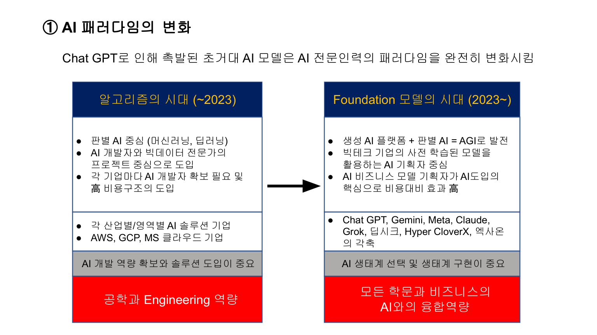
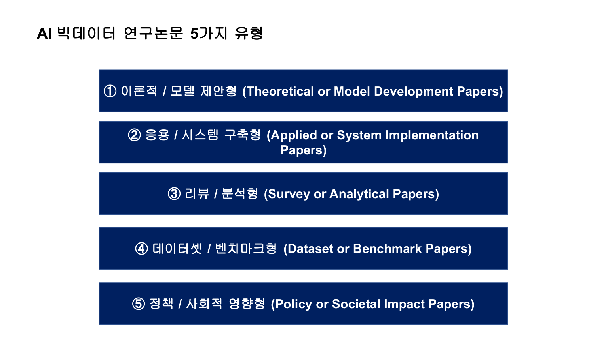

## AI 연구방법론 Intro

### 핵심 한 줄
- AI 연구는 `기술(모델)`과 `데이터(빅데이터)`를 동시에 설계해야 성과가 난다.

### 핵심 도표

### 복습 포인트 1: AI 패러다임 변화
- 과거: 판별 AI(분류/예측 중심) + 엔지니어 중심 도입
- 현재: 생성 AI + Foundation Model 기반 생태계 활용
- 실무 관점 변화:
- "모델을 직접 다 만든다"보다 "적절한 모델 생태계를 선택/융합한다"가 중요

### 복습 포인트 2: AI와 빅데이터의 결합
- 데이터 없이 AI 성능 확보 불가
- AI 없이 대규모 데이터의 가치 추출이 어려움
- 핵심 역량:
- 문제정의 -> 데이터 설계 -> 모델 선택 -> 검증/배포의 연결

### 복습 포인트 3: 빅데이터 분석 기본 관점
- 빅데이터 특성: 3V/5V/7V 관점으로 데이터 품질과 활용성 점검
- 분석 의미: DIKW(데이터-정보-지식-지혜) 관점에서 인사이트 단계화

### 복습 포인트 4: AI 연구논문 5가지 유형
- 1) 이론/모델 제안형:
- 새 알고리즘·아키텍처 제안, 성능/효율 개선 근거 제시
- 2) 응용/시스템 구축형:
- 산업·도메인 문제 해결, 실제 운영 효과 중심
- 3) 리뷰/분석형:
- 연구 동향 구조화, taxonomy와 비교분석 제시
- 4) 데이터셋/벤치마크형:
- 데이터 구축·평가체계 제안, 연구 생태계 기여
- 5) 정책/사회영향형:
- 윤리·거버넌스·제도·사회적 수용성 분석

### 복습 포인트 5: 유형별 작성 체크
- 공통 구조:
- `Abstract -> Introduction -> Related Work/Background -> Method/Framework -> Experiments/Analysis -> Discussion -> Conclusion`
- 반드시 확인:
- 재현 가능성(코드/절차), 비교 기준의 공정성, 한계/확장 방향 명시
- 유형별 강조점:
- 이론형은 수학적/실험적 기여
- 응용형은 운영성과(효율, 비용, ROI)
- 리뷰형은 분류체계와 최근 트렌드 정리
- 데이터셋형은 품질/윤리/접근성
- 정책형은 책임성/투명성/규제 연결

### 빠른 실행 체크리스트
- "내 주제는 5유형 중 어디에 속하는가?"
- "하고 싶은 것 vs 지금 할 수 있는 것을 구분했는가?"
- "데이터 확보 경로와 검증 계획이 있는가?"
