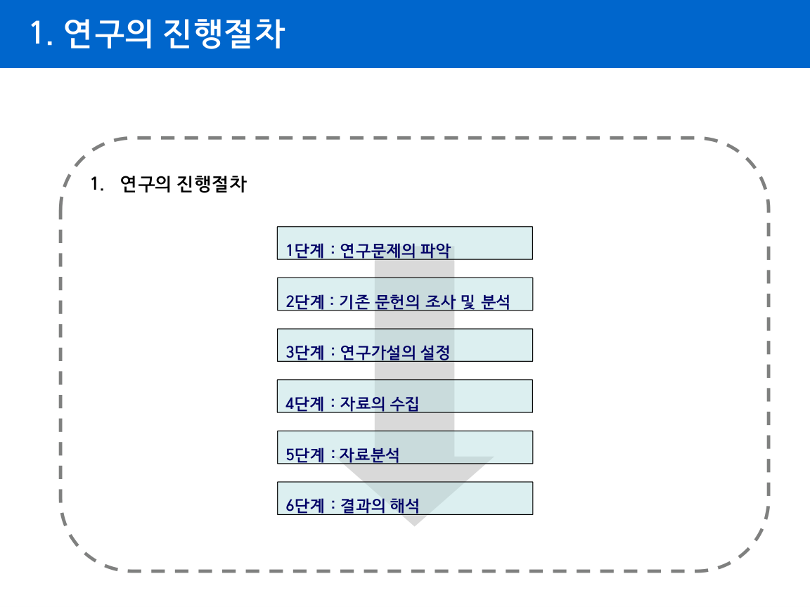
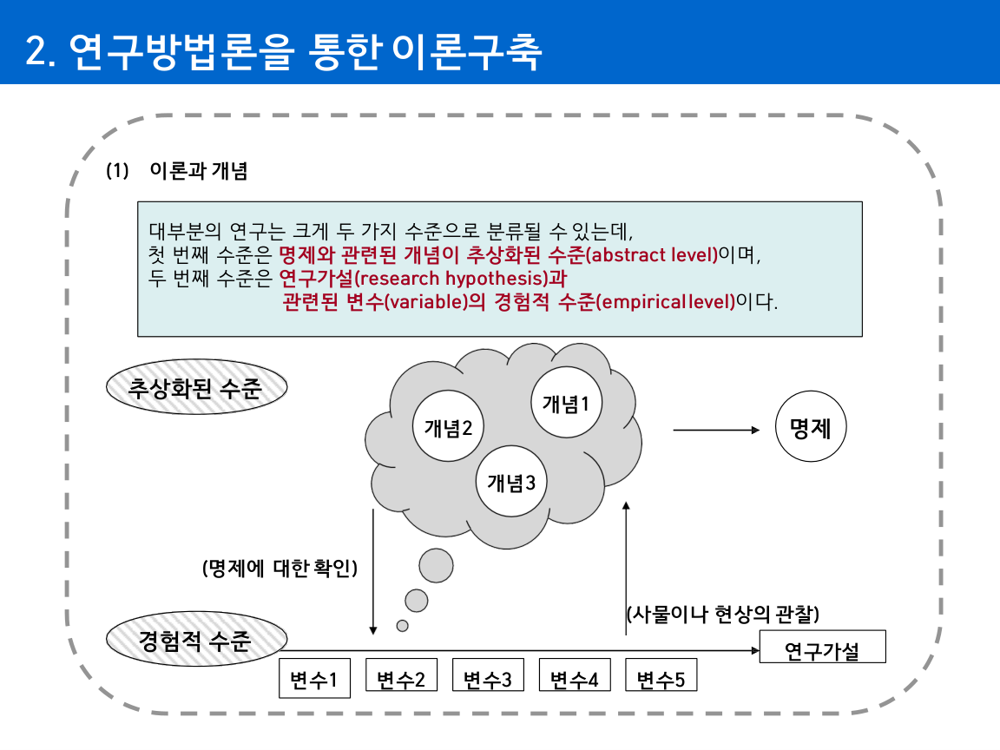

## 연구방법론의 이해 (General Research Methodology)

### 핵심 한 줄
- 연구방법론은 "이론(추상)"과 "가설·데이터(경험)"를 논리적으로 연결해 설명과 예측을 가능하게 한다.

### 핵심 도표

### 복습 포인트 1: 왜 연구방법론이 필요한가
- 단순 통계 수치의 맹신을 피하기 위해
- 상관과 인과를 구분하기 위해
- 재현 가능한 근거 기반 결론을 만들기 위해

### 복습 포인트 2: 연구의 진행 절차
- `연구문제 정의 -> 문헌조사 -> 연구가설 설정 -> 자료수집 -> 자료분석 -> 결과해석`
- 핵심:
- 연구설계는 전 단계(질문, 표집, 측정, 분석)에 영향을 주는 중심축

### 복습 포인트 3: 이론-개념-가설-변수
- 이론: 현상을 설명/예측하는 명제들의 체계
- 개념(construct): 현상을 추상화한 아이디어
- 가설: 검정 가능한 형태로 만든 기대 문장
- 변수: 개념을 측정 가능한 값으로 표현한 단위

### 복습 포인트 4: 과학적 방법과 통계적 추론
- 과학적 방법:
- 사전지식 정리 -> 개념/명제 구성 -> 가설 검정 설계 -> 데이터 수집/분석 -> 해석
- 통계적 추론:
- 표본으로 모집단 특성을 추정하고, 확률 기반 의사결정을 수행

### 복습 포인트 5: 연구방법 분류 프레임
- 자료형태: 질적 vs 양적
- 환경: 실험실 vs 현장
- 목적: 탐색적 / 기술적 / 인과
- 논리 전개: 연역 vs 귀납
- 결과 형태: 순수연구 vs 응용연구

### 복습 포인트 6: 논문 작성 기본
- 논문의 핵심 요건:
- 독창성, 객관성, 정확성, 공정성, 검증가능성, 가독성, 성실성
- 기본 3단 구성:
- 서론(문제·목적) -> 본론(방법·분석·논증) -> 결론(요약·시사점)
- 준비 4단계:
- 주제선정 -> 자료수집 -> 평가/정리 -> 원고작성

### 빠른 실행 체크리스트
- "연구문제가 검정 가능한 가설로 변환되었는가?"
- "독립/종속변수가 명확한가?"
- "표집/측정/분석 절차를 다른 사람이 재현할 수 있는가?"
