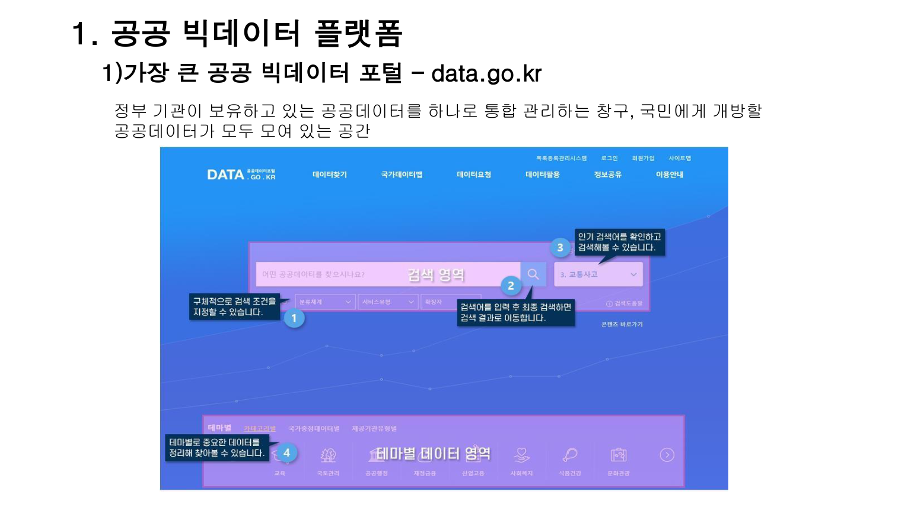
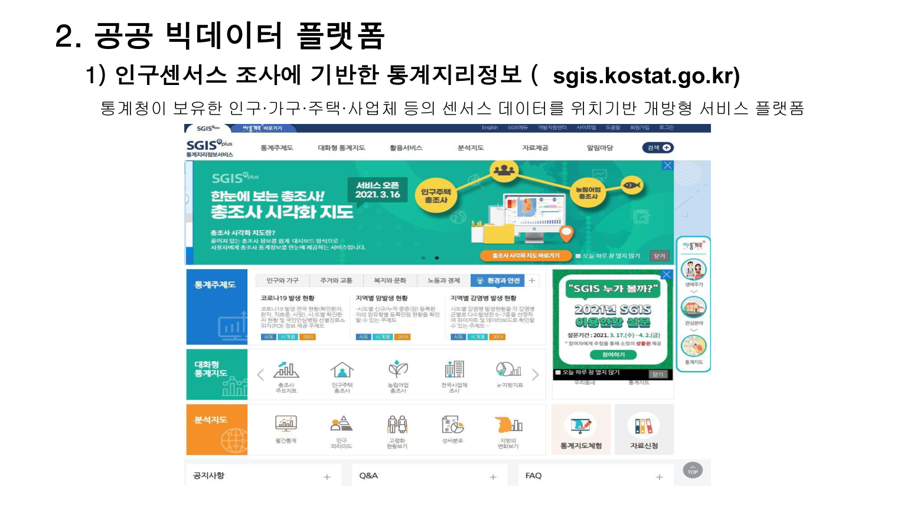

## AI와 빅데이터 (공공빅데이터 활용)

### 핵심 한 줄
- 공공데이터 활용의 성패는 "문제에 맞는 포털 선택 + API/통계/공간데이터 결합"에 달려 있다.

### 핵심 도표

### 복습 포인트 1: 국내 핵심 공공 포털
- `data.go.kr`: 공공데이터 통합 창구, Open API/파일 제공
- `kosis.kr`: 국가통계 원스톱 검색·표/시각화
- `sgis.kostat.go.kr`: 센서스 기반 통계지리정보(위치 결합 분석)

### 복습 포인트 2: 오픈데이터 보조 채널
- 검색 트렌드형 데이터:
- 네이버 DataLab, Google Trends
- 소셜 반응형 데이터:
- 연관어/감성 분석 계열 서비스

### 복습 포인트 3: 데이터 거래·연계 인프라
- 분야별 민간/공공 데이터 거래소 존재
- 플랫폼 맵 형태 포털을 통해 다수 플랫폼 탐색 가능
- 실무 포인트:
- 데이터 품질, 라이선스, 활용 목적 적합성 우선 검토

### 복습 포인트 4: 국내외 데이터 소스 확장
- 국내:
- 공공기관 포털, 지자체 데이터 포털, AI/빅데이터 허브
- 해외:
- 국가 오픈데이터 포털, 국제기구 데이터, 공개 ML 데이터셋 저장소

### 복습 포인트 5: 경진대회 활용
- 목적:
- 문제정의-데이터전처리-모델링-평가의 풀사이클 훈련
- 활용:
- 주제 탐색, 베이스라인 확보, 재현 가능한 실험 습관 형성

### 실무형 수집 루트 (추천)
- 1) 연구질문 확정:
- 필요한 변수/시간/공간 단위를 먼저 정의
- 2) 1차 수집:
- `data.go.kr`, `KOSIS`, `SGIS`에서 원천 확보
- 3) 보강 수집:
- 트렌드/소셜/민간데이터로 설명변수 보강
- 4) 검증:
- 결측, 단위 불일치, 표본 편향, 라이선스 점검

### 빠른 실행 체크리스트
- "포털 선택 근거(왜 이 소스인가)가 있는가?"
- "API 호출/수집 재현 로그를 남겼는가?"
- "공간/시간 단위를 통일했는가?"
